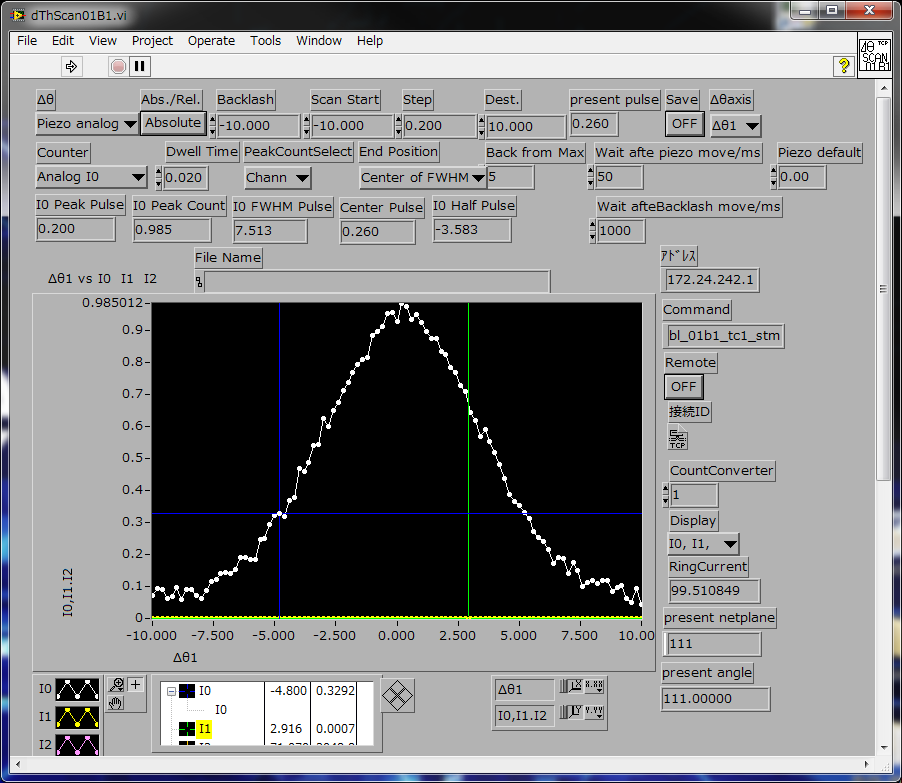
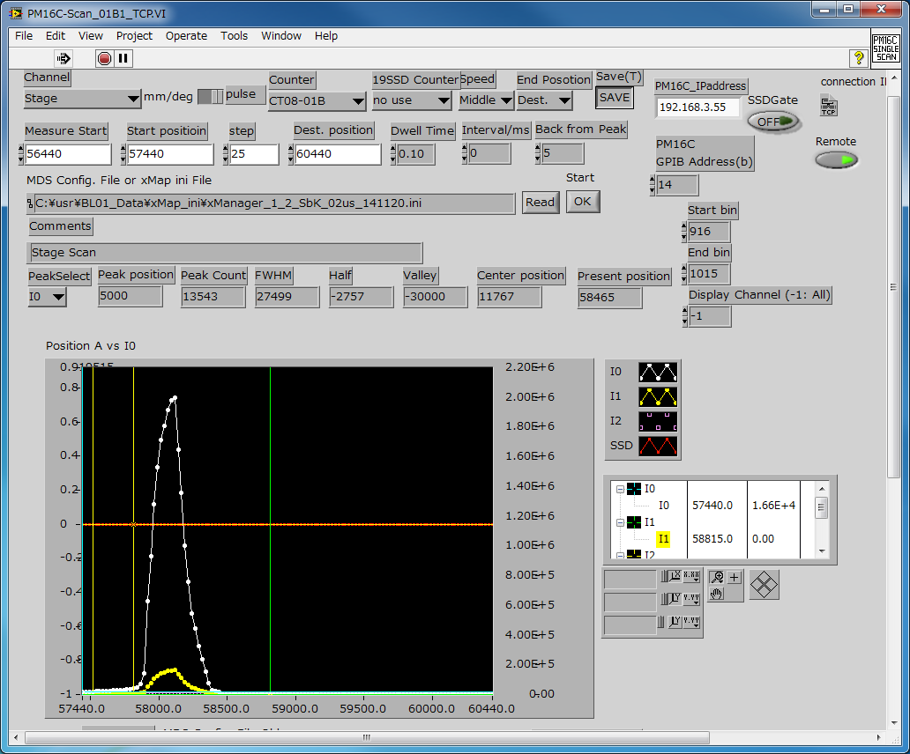

.. include:: <isogrk3.txt>
.. |angstrom| unicode:: U+0212B .. Angstrom

光学調整
========

.. warning::
   
   2021年11月現在，BL01B1 の現状に全く追随できていないため，公式マニュアルを参照することを強く推奨します．

.. warning::
   
   この文書は，**非公式** マニュアルです．著者はこのマニュアルを参照することによって生じうる一切の責任を負いません．**この文章の意味が理解できない人は，マニュアルを参照することを直ちにやめてください．**

.. warning::
   
   初心者向けの説明のため，各操作の意味や自動的に実行されてユーザ側で操作が必要ない処理の説明を省いています．

Netplane & Mirror の起動
------------------------

操作
~~~~

1. Menu3.vi の Optics タブから Netplane & Mirror 選択し，|runbutton| Run ボタンをクリックする．

   
   Netplane & Mirror の選択

   
   Netplane & Mirror Window

.. note::
   
   以後，「実行」という場合，|runbutton| Run ボタンをクリックすることを指す．

Optics 調整目標の設定
---------------------

操作
~~~~

1. Select Net Plane, |theta|/degree, 1st Mirror Angle, 2nd Mirror Angle を設定し，右上の Start "OK" をクリックして開始する．
2. Check BL-WS GUI! および Check I0 gas! が表示されたら， **BL-WS が動作していること，I0 ガスが適切に設定されていること確認して，OK をクリックする**．
3. Close MBS&DSS! という Window が表示されたら，指示通り **MBS と DSS を手動で閉じてから，OK をクリックする**．
4. 続いて，TCStage_TCP... という Window が表示されるが何も操作する必要は無い．

.. note::

   Select Net Plane には利用する結晶面，|theta|/degree には利用するおおよそのエネルギーに対応する結晶の角度，1st, 2nd Mirror Angle には高次光除去に適当なミラーの角度を入力する．

   
   Optics 調整開始

   
   Close MBS&DSS!

   
   結晶面変更時の様子

   
   TC Stage の調整	

Optics 調整の開始
-----------------

操作
~~~~

1. Close MBS&DSS! という Window が表示されたら，指示通り **MBS と DSS を手動で開けてから，OK をクリックする**．
2. Check LOCAL+REMOTE Mode! Open DSS Manually! という Window が表示されるので，**DSS を手動で開け，LOCAL+REMOTE モードに設定してから，OK をクリックする**．

   
   Open MBS&DSS!

   
   Check LOCAL+REMOTE Mode! Open DSS Manually!

二結晶分光器平行度の粗調整
--------------------------

操作
~~~~

1. |Delta|\ |theta|\ 1 Stepping Motor Scan(1)? という Window が表示されるので，OK をクリックする．自動的に |Delta|\ |theta|\ 1 が実行される．
2. Move_Rescan.vi という Window が表示されるので，Move をクリックする．

   
   |Delta|\ |theta|\ 1 Stepping Motor Scan(1)?

   
   二結晶分光器 |Delta|\ |theta|\ 1 スキャン

   
   二結晶分光器 |Delta|\ |theta|\ 1 移動位置の指定

二結晶分光器平行度の精密調整
----------------------------

操作
~~~~

1. |Delta|\ |theta|\ 1 Piezo Scan(1)? という Window が表示されるので，OK をクリックする．自動的に |Delta|\ |theta|\ 1 の Piezo scan が実行される．
2. Move_Rescan.vi という Window が表示されるので，Move をクリックする．

   
   二結晶分光器 |Delta|\ |theta|\ 1 Piezo スキャンダイアログ

   
   二結晶分光器 |Delta|\ |theta|\ 1 Piezo スキャン

   
   二結晶分光器 |Delta|\ |theta|\ 1 Piezo 素子移動位置の指定

分光器の調整
------------

操作
~~~~

1. 4D Slit Horizontal Scan for Fixed Exit(1)? という Window が表示されるので，OK をクリックする．自動的に Fixed Exit(1) 4D Slit の Horizontal scan が実行される．
2. Move_Rescan.vi という Window が表示されるので，Move をクリックする．
3. Axis に Move |Delta|\ |alpha| for と書いてある Window が表示されるので，OK をクリックする．
4. 4D Slit Rescan? という Window が表示される．指示通り，\|\ |Delta|\ |alpha|\| が 10 以上の場合，OK(Rescan) をクリックし，10 未満の場合，Cancel(Next Step) をクリックする．OK(Rescan) をクリックした場合，2. に戻る．

   
   4D Slit Horizontal Scan for Fixed Exit(1)?

   
   Fixed Exit(1) 4D Slit の Horizontal scan

   
   Move |Delta|\ |alpha| for

   
   4D Slit Rescan? この場合，\|\ |Delta|\ |alpha|\| > 10 pulse なので，OK(Rescan) をクリックする．

   
   4D Slit Rescan? この場合，\|\ |Delta|\ |alpha|\| < 10 pulse なので，Cancel(Next Step) をクリックする．

二結晶分光器平行度の精密調整(2)
-------------------------------

操作
~~~~

1. |Delta|\ |theta|\ 1 Piezo Scan(2)? という Window が表示されるので，OK をクリックする．自動的に |Delta|\ |theta|\ 1 の Piezo scan (2回目) が実行される．
2. Move_Rescan.vi という Window が表示されるので，Move をクリックする．

   
   二結晶分光器 |Delta|\ |theta|\ 1 Piezo スキャンダイアログ

   
   二結晶分光器 |Delta|\ |theta|\ 1 Piezo スキャン

   
   二結晶分光器 |Delta|\ |theta|\ 1 Piezo 素子移動位置の指定

後置集光ミラーの高さ調整
------------------------

操作
~~~~

1. 2nd Mirror Vertical Scan? という Window が表示されるので，OK をクリックする．自動的に 2nd Mirror の Vertical Scan が実行される．
2. Move_Rescan.vi という Window が表示されるので，Move をクリックする．

   
   2nd Mirror Vertical Scan?

   
   MIRROR-SCAN_01B1_TCP.vi

   
   2nd Mirror 移動位置の指定

スリット (2) 位置の調整
-----------------------

操作
~~~~

1. TC Slit 2 Vertical Scan? という Window が表示されるので，OK をクリックする．自動的に TC Slit 2 の Vertical Scan が実行される．
2. Move_Rescan.vi という Window が表示されるので，Move をクリックする．

   
   TC Slit 2 Vertical Scan?

   
   TCSlit-SCAN_01B1_TCP.vi

   
   TC Slit2 の移動位置の指定

スリット (3) 位置の調整
-----------------------

操作
~~~~

1. TC Slit 3 Vertical Scan? という Window が表示されるので，OK をクリックする．自動的に TC Slit 3 の Vertical Scan が実行される．
2. Move_Rescan.vi という Window が表示されるので，Move をクリックする．

   
   TC Slit 3 Vertical Scan?

   
   TCSlit-SCAN_01B1_TCP.vi

   
   TC Slit 3 の移動位置の指定

測定用定盤の高さ調整
--------------------

操作
~~~~

1. Stage Vertical Scan? という Window が表示されるので，OK をクリックする．自動的に Stage の Vertical Scan が実行される．
2. Move_Rescan.vi という Window が表示されるので，Move をクリックする．

   
   Stage Vertical Scan?

   
   PM16C-Scan_01B1_TCP.vi

   
   Stage の移動位置の指定

最終調整
--------

操作
~~~~

1. 最終調整が行われる．ユーザー側で操作の必要は無い．

   
   Optics 最終調整

   
   Optics 最終調整完了

