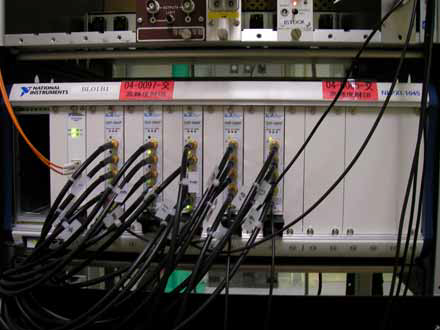
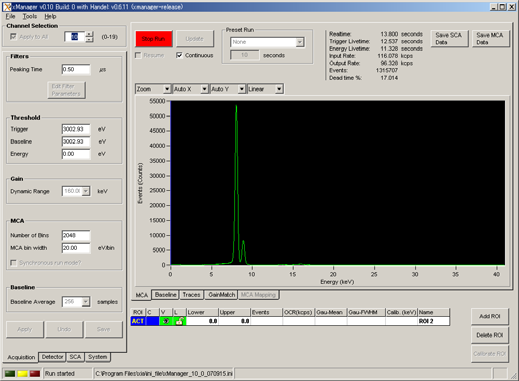
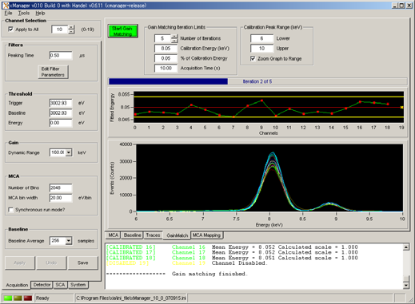
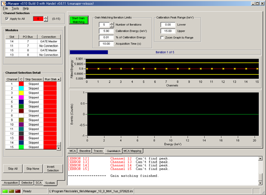
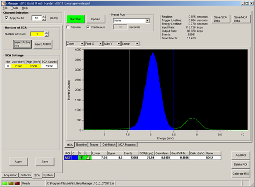
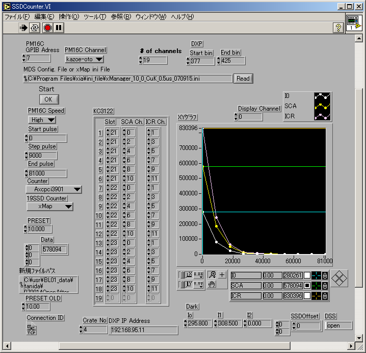
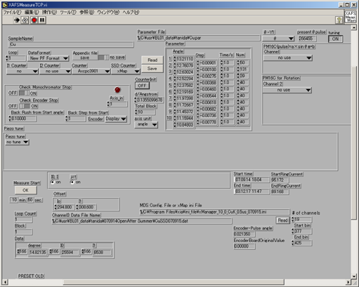

.. include:: <isogrk3.txt>
.. |angstrom| unicode:: U+0212B .. Angstrom

19 素子 SSD の調整および利用
============================

.. warning::
   
   2023年6月現在，BL01B1 の現状に全く追随できていないため，公式マニュアルを参照することを強く推奨します．そのうち更新するかもしれません．

.. warning::
   
   この文書は，**非公式** マニュアルです．著者はこのマニュアルを参照することによって生じうる一切の責任を負いません．**この文章の意味が理解できない人は，マニュアルを参照することを直ちにやめてください．**

準備
----

xMap の起動と試料の設置
~~~~~~~~~~~~~~~~~~~~~~~

1. プリアンプ電源とｘMap の電源を入れて，30 分以上 Warm up する．
2. Detector High Voltage (?) の SSD タブから SSD に -1000 V を印可する．（電圧は自動的にゆっくりと印可される．）
3. 蛍光強度が十分に大きい試料（例えば，金属箔，酸化物の透過法測定用標準試料）をセットする．
4. SSD を試料から最も遠い位置に設置する．金属箔を利用する場合は，4DSLIT の開口を小さくして，SSD に必要以上に蛍光が入って，ダメージを与えることがないようにする．

   
   xMap (19素子 SSD に利用されている digital signal processor (DSP))

xManager の起動
---------------

19素子 SSD に利用されている digital signal processor (DSP) の xMap のパラメータを xManager を利用して設定する．

操作
~~~~

1. デスクトップ上の xManager のショートカットアイコンからプログラムを起動する．xMap 初期化に約 30 秒かかかる．
2. メニューバーの File から Open Configration File をクリックして，xMap_ini フォルダ内にある以前と同じ，もしくはエネルギーの近い元素の ini ファイルを読み込む．ini ファイルを読み込むと xMap の初期化に再度約 30 秒程度かかる．
3. ini ファイルを読み込んだ後，すぐにメニューバーの File から Save Configration File as をクリックして，今回の測定用に新しく名前をつけて保存する．（パラメータを変更するたび，頻繁に ini ファイルが上書きされるため，すぐに別名で保存しないと，2. で読み込んだ .ini ファイルのパラメータが上書きされ続ける．
4. DSS をあけて，xManager 上で Input Rate が 200 kcps 以下であることを確認する．もし 200 kcps 以上なら，SSD を試料から遠ざける，4D slit の開口幅をより小さくして，入射 X 線あるいは蛍光 X 線強度を小さくする．

   
   xMap のメインウィンドウ

xManager のパラメーター調整
---------------------------

操作
~~~~

1. MCA の画面で Start ボタンを押して、画面上で蛍光スペクトルを確認する．パラメータを変更するときは Stop ボタンを押して，計測を停止する．パラメーターの値を変更した後は Apply ボタンを押す．
2. Peaking Time を調整する。5.9 keV の蛍光X 線で 0.5 |mu|\ s が既定値である．Peaking time を小さくすると，エネルギー分解能は悪くなるが，より多くカウントすることができる．経験的に 5 keV 以下で 1 |mu|\ s，20 keV 以上で 0.2 |mu|\ s 程度がよい．
3. Threshold の Trigger と Baseline を調整する．既定値は1000 eV であり、この値以下のバックグラウンドノイズの蛍光をカットしている．この値は経験的に測定対象の蛍光 X 線のエネルギーの 1/3 から 1/2 以下にするとよい．
4. Number of Bins と MCA Bin Width を調整して，蛍光ピークが画面の中心付近に来るようにする．既定値は 2048 と 20 eV/bin である．蛍光のエネルギーが高いときは，MCA Bin Width を小さくするとよい．
5. Channel Selection の数字を変更して，すべての素子の信号を確認する．

.. note::
   
   xManager の起動で以前の .ini ファイルを読み込んだ場合，2-4 の操作は不要であることが多い．

Gain Match (SSD のエネルギー較正)
---------------------------------

操作
~~~~

1. Gain Match タブを押して，Gain Match 画面に切り替える．
2. Calibration Energy に対象元素の K\ |alpha| をテーブルから読み取って入力する。このとき，最も高い蛍光ピークが対象元素の K\ |alpha| であること．
3. Calibration Peak Range が Calibration Energy の範囲内にあること．Calibration Peak Range の±2 keV ぐらいがよい．
4. Start Gain Matching を押して，画面上で Gain Match が終了するまで待つ．
5. 測定中にカウンタが停止したり，X 線が SSD に入らなくなったときはエラーが出る．System タブで画面を切り替えて，Skip None ボタンを押し，すべての素子を Ready にする．

   
   Gain Match ウィンドウ

   
   Gain Match

SCA (ROI) の設定
----------------

1. MCA タブを押して，MCA スペクトル表示画面に，SCA タブを押して，SCA 設定画面にする．
2. カーソルをドラッグして、対象ピークの下限と上限を設定する。青色の部分が設定した SCA になる。グラフ下の表で設定値を確認できる。もしカーソルが画面上にないときはマウスを右クリックして、カーソルを表示する。グラフ内で左クリックしながらドラッグすると、画面を拡大できる。横軸のメモリ上で左クリックしながらドラッグすると、画面の横移動ができる。Auto Scale に戻すときはグラフ上のプルダウンメニューで選択する．
3. Number of SCAs に 0 を入力して，Apply ボタンを押すと、以前の ROI 設定がクリアされる．Insert Active ROI ボタンを押すと，現在の ROI が入力されるので，Apply ボタンを押して，確定する．

   
   ROI の設定

ini ファイルの保存
------------------

操作
~~~~

1. メニューバーの File から Save Configuration File as を選んで，ini ファイルの名前を確認して保存し，xManager を終了する．

カウント値の確認
----------------

1. 測定対象の実試料をセットする．
2. Menu3.vi から SSDCountCheck を実行する．
3. Read ボタンを押し，今回の測定用に作成した .ini ファイルを読み込む．xMap の初期化に約 30 秒かかる．
4. Start ボタンを押して SCA と ICR のカウントを確認する．

.. note::
   
   ICR が 100000 cps 以下であることを確認する．ICR が 100000 cps を超えると，後述の「数え落とし補正」が成り立つ条件から外れてしまい，適切に「数え落とし補正」できなくなる．19素子 SSD を利用しようとする試料の場合，ICR が 100000 cps を超えることは少ないが，例えば，共存元素の蛍光 X 線が多い場合，薄膜試料の基板からの散乱 X 線により ICR が大きくなることがある．その場合，試料と SSD の間に適切なフィルターを設置したり，4D slit の開口幅を狭くしたりして，SSD に入射する X 線量を制限する．

.. note::
   ICR 100000 cps はあくまで目安であり，実際には Dead time が重要である．Dead time は，xManager から簡単に確認できるので，必要に応じて，xManager で確認すること．

数え落とし補正パラメータの見積もり
----------------------------------

操作
~~~~

1. 対象元素の蛍光 X 線エネルギーに適した回転円板のアッテネータを 4D SLIT とI0 イオンチャンバーの間に入れて，ケーブルを接続し，ドライバ電源を入れる．場所が分からないときはビームライン担当者に聞くこと．
2. Menu3.vi 内の DeadTimeCorrection を実行する．
3. Read ボタンを押し，今回の測定用に作成した .ini ファイルを読み込む．xMap の初期化に約 30 秒かかる．
4. Start ボタンを押すと，自動的に数え落とし補正パラメータの見積もりに必要な測定が実行される．画面上で測定が終了するまで待つ.

   
   数え落とし補正パラメータのための測定

XAFS 測定
---------

1. 試料前スリット (4D Slit) の開口を試料のサイズに合わせ，I0 のカレントアンプの Gain が最適な値になっているかを確認すること．できれば試料交換ごとに毎回，特に異なる試料濃度の測定を行う前には，SSD Count Check.vi で蛍光 X 線強度を確認し，必要に応じてスリットの開口を変更したり，SSD を試料から離して，最適なカウント数（一素子あたり 50000-100000 cps もしくはそれ以下）にすること．
2. Menu3.vi 内の XAFS measure プログラムを実行する．
3. SSD Counter に xMap を選ぶ．I1 Counter に no use を選ぶと，SSD のカウントのみデータファイルに保存する．Fluorescence を選ぶと I1 の信号もデータファイルに保存できるが，たいていの場合は必要ない．
4. Read ボタンを押し，今回の測定用に作成した .ini ファイルを読み込む．xMap の初期化に約 30 秒かかる．
5. 通常の測定と同様にパラメータファイル等の他に必要な設定を行い，測定する．

   
   XAFS Measure

